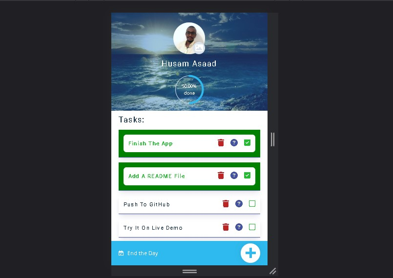

# Things TO-DO

\*\*Project description
This is a To-Do App built using vannila JavaScript and CSS

## Table of contents

- [Overview](#overview)
  - [The challenge](#the-challenge)
  - [Screenshot](#screenshot)
  - [Links](#links)
- [My process](#my-process)
  - [Built with](#built-with)

## Overview

### The challenge

- in Project I finally escaped tutorials hell and actually built something by myself and the challenge was to create the app in a way that it will function the same way I used to do by Pen and Paper..

- I add a Task, descripe it, then when I'am done I write down how much time did it take and this is exactly what this app does

### Screenshot

### Links

- Live Site URL: [Add live site URL here](https://your-live-site-url.com)

## My process

### Built with

- Semantic HTML5 markup
- CSS custom properties
- Flexbox
- CSS Grid
- Mobile-first workflow
- JavaScript
- SweetAlert 2
